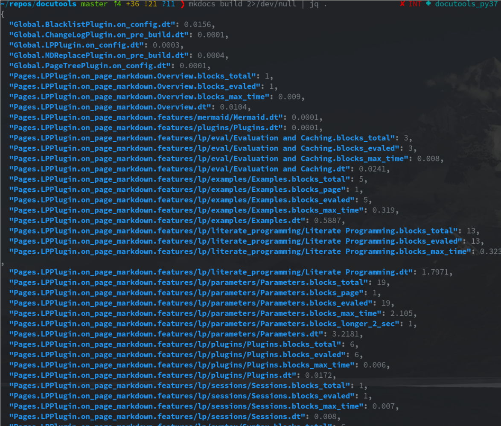

# Stats :lnksrc:fn:src/lcdoc/mkdocs/stats/__init__.py,t:

Usage: :lnksrc:fn:src/lcdoc/assets/mkdocs/mkdocs.yml,m:lcd-stats,t:m

Prints collected stats on stdout after build.

Intended for piping into / consolidation with [jq](https://stedolan.github.io/jq/download/).

## Config

    config_scheme = (('round_digits', config_options.Type(int, default=4)),)

## Mechanics

- We print the stats to stdout at the end of a build, as a json string.
- All logging and other build output must go to stderr, otherwise jq cannot work.
- All hooks of lcd-plugins are wrapped into a decorator, which sets a named stats dict into them
  (and also customizes logging), so
  they can just set counters and metrics into those dicts.
- When the hooks are page hooks we set those dicts per page.

## Example Output

