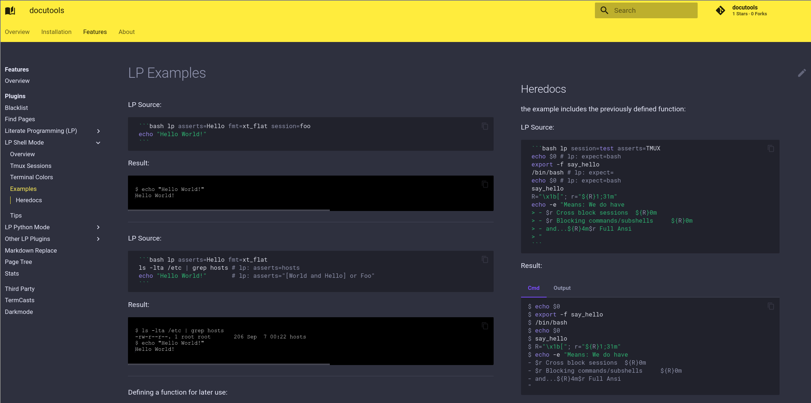

# :srcref:fn=src/lcdoc/mkdocs/lp/plugs/columns/__init__.py,t=columns

Applies an n-column layout using flex box.

Default Parameters:

```python lp:show_src delim=lp_column_dflts dir=src/lcdoc/mkdocs eval=always
```

## Mechanics

We format the html content like so

### Before

```
mdblock1

`lp:columns <params>`

mdblock2

`lp:columns <params>`

mdblock3

```

### After

```html
<div class="lp-row">
    <div class="lp-column">
         html1 (rendered mdblock1)
    </div>
    <div class="lp-column">
         html2
    </div>
    <div class="lp-column">
        html3
    </div>
</div>

<style>
    User or default (flexbox) style base on above css classes.
</style>
```


## Example


