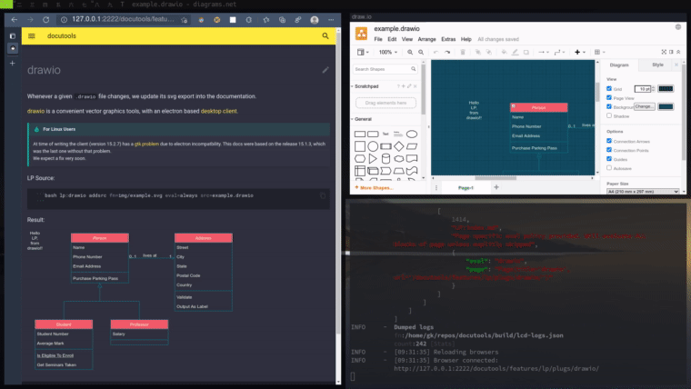

# :srcref:fn=src/lcdoc/mkdocs/lp/plugs/drawio/__init__.py,t=drawio

Whenever a given `.drawio` file changes, we trigger an export to svg, so that your documentation updates.

[drawio](https://app.diagrams.net/) is a convenient vector graphics tools, with an electron based [desktop client](https://github.com/jgraph/drawio-desktop/releases).

## Example

`lp:drawio addsrc fn=img/example.svg eval=always src=example.drawio`

## Requirements

- A `drawio` executable must be available in your `$PATH`.
- Alternatively you may specify `$drawio` as in: `$ drawio=/opt/drawio/bin/drawio mkdocs serve`

## Notes

- As you can see in the screencast the update is not particularly fast since the exporter has the
  start the app at every svg build.

- Linux Version:

    At time of writing the client (version 15.2.7) has a [gtk
    problem](https://github.com/jgraph/drawio-desktop/issues/706) due to electron incompatbility.
    This docs were based on the release 15.1.3, which was the last one without that problem.   
    We expect a fix very soon.

`lp:lightbox`

