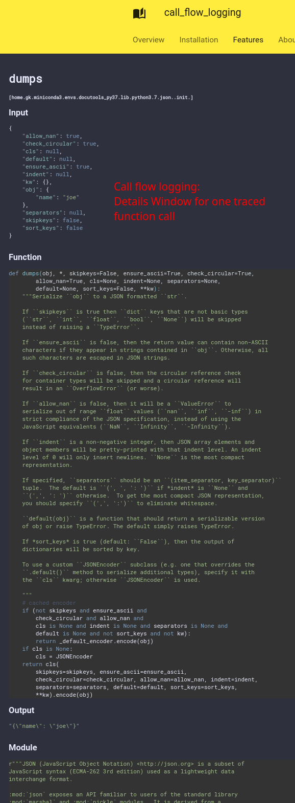

# :srcref:fn=src/lcdoc/mkdocs/lp/plugs/python/pyplugs/call_flow_logging/__init__.py,t=Callflow Logging

Function calling sequence as a plantuml sequence diagram.


!!! caution "Experimental Feature"
    
    Callflow logging is not a wrapper for a 3rd party library but docutools "native". It was
    transferred from another project and the code base contains some legacy.  
    The feature is useable but in a beta state.


## Mechanics

1. Callflow logging works via the `sys.set_trace` hook, being invoked at function entry and exit, a feature
which also the coverage package uses in order to record code coverage.

1. This implementation here allows to specify which functions, classes, modules should be traced, so that the call flow charts
only contain interesting stuff.

1. We record input and exit data plus invokation and exit times.

1. Then we draw plantuml files, incl. links to statically deliverable json files, with more information.

1. Once we have the plantuml files, we create svgs using the [kroki](../../plugs/kroki/) plugin.

1. The svg is embedded into the html, in order to get javascript click handlers working.

1. A javascript part takes care for proper formatting within mkdocs and fetching the details on
   mouse over and click events.

See the example.


## Syntax

- Add `cfl` as header parameter, in order to get the LP block written into standalone importable
  module, created in your build directory.

- In the `show('callflow', call=..., trace=[<list of traced object>])` function call supply the entry function to be wrapped and a number of objects to be traced. These may be modules, classes and functions.

- You may supply [kroki](../../plugs/kroki/) header parameters like `server` and `puml` for style,
  since we call this module to render the created plantuml into an svg.


!!! important
    
    - Every change of the lp code body will result in new flow charts being created, together with all
    in and out parameters. That might pile up, so please clear your build dir from time to time and
    git-ignore it.  
    - The docs dir gets a symlink over to the build dir: `docs/autodocs`.


## Example

We trace the standard lib's json module while calling `dumps`:

```python lp:python cfl addsrc

import json
def say_hello(n):
    print(n)
    return json.dumps({'name': n})

def test_flow():
    say_hello('joe')

show('call_flow', call=test_flow, trace=json)

```

Move the mouse over the arrows and click to see the full data recorded.

!!! note "Call Flow Details"
    You should get details infos like these

    

++ctrl+r++ (reload) to get back to your original documentation page.


??? "Questions and Comments?"
    `lp:python show=comments theme=icy-dark eval=always`
