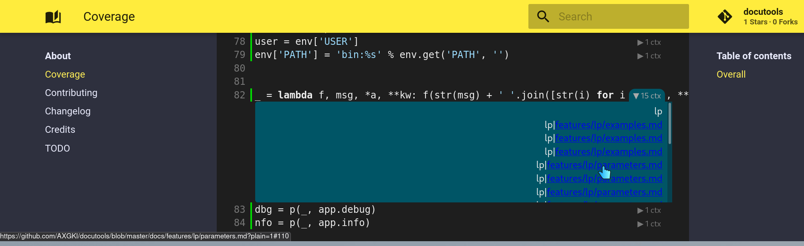

# :srcref:fn=src/lcdoc/mkdocs/lp/plugs/python/pyplugs/cov_report/__init__.py,t=Coverage Report

Inserts a coverage report into the docs set.

Based on [pawamoy][pw]'s work.

[pw]: https://github.com/pawamoy/mkdocs-coverage/tree/master/src/mkdocs_coverage

LP Header Syntax: `bash lp mode=cov_report [dir=<report dir>]`

The report must exist in the file system at evaluation time at

- `dir` parameter or
- `$d_cover_html` env var

## Features:

- While LP blocks are running, the LP plugin creates a [coverage context](https://coverage.readthedocs.io/en/coverage-5.5/contexts.html#dynamic-contexts),
  with the current markdown file.
- When the lp plugin has a non empty config value for `coverage_backrefs`, a link will be created back to the markdown source with the lp block.

## Example

## Mechanics

How to create coverage reports in general: See the coverage setup in this repo's :srcref:make file.

- At :srcref:fn=.github/workflows/ci.yml,t=CI/CD , `make tests` and `make docs` are run, both creating their coverage data file.
- `make cover` combines them and creates the html report. 
- Finally at `mkdocs gh-deploy` time, the html report is copied over to the site directory, so that
  it is present in the docu build.

`lp:lightbox`
